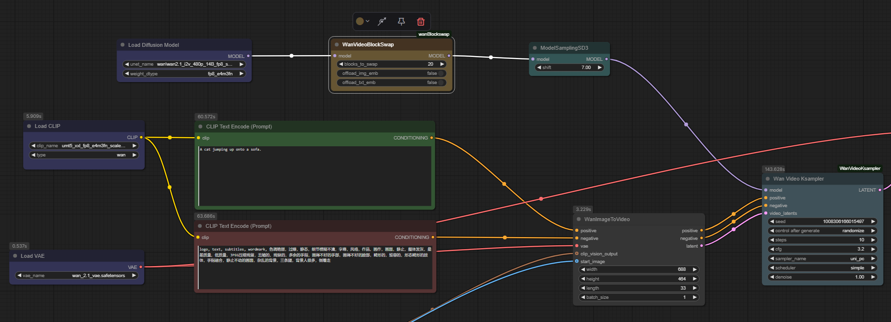

### フォーク版の特徴
このリポジトリは、Wan2.2 i2v 14BモデルでLora適用時に発生するサイレントクラッシュの対策を行ったものです。

### ComfyUI-wanBlockSwap
This is a simple Wan block swap node for ComfyUI native nodes, works by swapping upto 40 blocks to the CPU to reduce VRAM.

